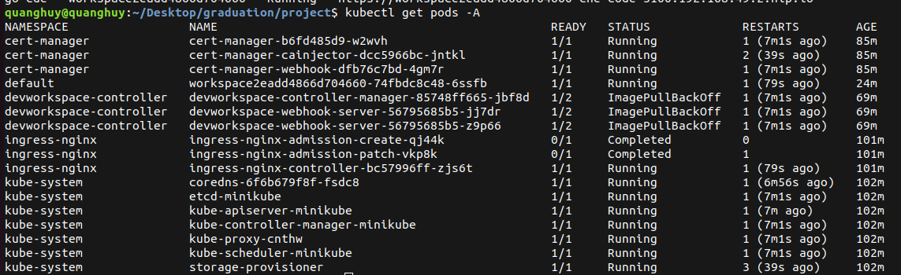

# Helm chart cho DevWorkspace Operator
## 1. Thực hiện
### a. Tiền điều kiện
#### Cài Ingress
- Hiện em dùng minikube nên chỉ cần: `minikube addons enable ingress`
#### Cài cert-manager
```sh
helm repo add jetstack https://charts.jetstack.io --force-update
helm install \
  cert-manager jetstack/cert-manager \
  --namespace cert-manager \
  --create-namespace \
  --version v1.16.2 \
  --set crds.enabled=true
```
### b. Tạo helm chart
- Tạo helm chart
```
helm create devworkspace
```
- Lấy các file YAML từ repository của devworkspace-operator [tại đây](https://github.com/devfile/devworkspace-operator/tree/main/deploy/deployment/kubernetes)
> Trong đó, [`combined.yaml`](https://github.com/devfile/devworkspace-operator/blob/main/deploy/deployment/kubernetes/combined.yaml) chứa tất cả các định nghĩa crds, deployments, và service. Và [`default-config.yaml`](https://github.com/devfile/devworkspace-operator/blob/main/deploy/default-config.yaml) chứa thông tin cấu hình.
- file `values.yaml`
```yml

routingSuffix: 192.168.49.2.nip.io
defaultRouting: basic
pullPolicy: IfNotPresent
```
- Cài helm chart.
```
helm install devworkspace-operator .
```
## 2. kết quả
- Trạng thái cụm sau khi cài


> ImagePullBackOff vì proxy, em dùng 4G thì nó pull về và chạy bình thường.
- Sử dụng 1 YAML file để định nghĩa cho project được clone
```YAML
kind: DevWorkspace
apiVersion: workspace.devfile.io/v1alpha2
metadata:
  name: go-cde
spec:
  started: true
  template:
    projects:
      - name: outyet
        git:
          remotes:
            origin: https://github.com/l0rd/outyet
    components:
      - name: devtools
        container:
          image: quay.io/devfile/universal-developer-image:ubi8-latest
          memoryRequest: 2G
          memoryLimit: 8G
          cpuRequest: '1'
          cpuLimit: '4'
  contributions:
    - name: vscode
      uri: https://eclipse-che.github.io/che-plugin-registry/main/v3/plugins/che-incubator/che-code/latest/devfile.yaml
      components:
        - name: che-code-runtime-description
          container:
            env:
              - name: CODE_HOST
                value: 0.0.0.0
```
- Apply file này vào cụm
```sh
kubectl apply -f dw.yaml
```
- Kết quả:


# II. Cập nhật lại cấu trúc thư mục
- Các custom-resource-definition được lưu trong [`crds`](./crds/)
- Tách các RBAC và service vào các folder tương ứng
  - edit-workspaces
  - leader-election
  - metrics
  - proxy
  - view-workspaces
# III. Tách các biến sang `_help.tpl` và `values.yaml`
- Labels được viết vào trong `_help.tpl`
```tpl
{{/*
Common labels
*/}}
{{- define "devworkspace-operator.labels" -}}
{{ include "devworkspace-operator.selectorLabels" . }}
{{- end }}

{{/*
Selector labels
*/}}
{{- define "devworkspace-operator.selectorLabels" -}}
app.kubernetes.io/name: {{ include "devworkspace-operator.name" . }}
app.kubernetes.io/part-of: devworkspace-operator
{{- end }}
```

- Các biến động được đưa vào trong `values.yaml`
> Mới chỉ có trong deployment.yaml, các file khác chưa áp dụng.

- Kết quả: [result](https://helm-playground.com/#t=IYBwlgagpgTgzmA9gOwFwAJQjgegG4CMAUANZjIAmGAIlCADaICeAtlMgC5FsfAXC9URdOnrAARlHpwhI5MDYYA3kvQA6CMHoBXKHDXy2cEMADGUdAF9LAWhbB5Ac1jD0hvSfPLVGrbv3uxmYW1kTGUKay6Co26GAAZm6IHOqaOnpqwNociHCmWuSOauwS9FAUVpauMHT0YPky0T5p-mo1DPXAAMKI2pyVrjHo7BWhInBSETkwUSL2HKYAFgAyElIyrhxQLAwCULPoPHwCwAciQwDuYByLqX4ZIIgUAILIyMkCSMhwAyJ-mG8Phwvht-v8hjkAJoKejqdAAHzc5Ao7BSAA5fmChiNMf8xJJpGc-pdrrdfOl9I8KKsCT8xmDzkpYlCYXDEchkaj0Bj6QzsZRcehwpFXOCmegrjc7hS1GB7M4AAraej0ADKERqHDpVQZcuAiuVao1UC1RMZzMQ0JYsLUCKRlC5PJ1WPFON5fwmpm0MGuTB6nCgAA8OGamharTaWg8nuqvT6OH6UFtg3aOQ7%2Bk7RX9TEngORYKCwbFgDBHIW%2BeKYA5nNLWnrnGoc5w88gC5lS9qs-9Yio4e6xbE3c6Gew8KGhlXkDXyXX5VBG7n8-Bisg8ILu24FPsmup3OuXbEEuo8Pd9-8T%2BlvMfT4iAI7aZIhYcMsPDaQWI9qC%2B6ABiMEQLBnn835QH%2BAGhgO6Asta17pGBgHspy-QEAATEB5rDAK-bEq6WHPv89bbgARL2M4ZIRbR0Lk1yIDATCVKgpFRvoFG8I4doovEWT0CkahdIsJYcGozwgCA0DwF81hEV2fyEUqKoKogdSmEwV5kSxc5qCAhqKcp9HYSIdR4OwehwAq-6SBBr7QZG9z6EZJlwGZFkWIh6YpKhBmbooO58QJMBCQAcluQGPAF5ZFt525NsZEkoDJ-xNrwS6KQFanMWoEwwHg9TzjFBZfKlKReSIID-jkOb0BgAAqXQKgl6CxO4GAOa2Tk2GFXAvtmi6tjARXpXZmWwDl5hqK1plFUBNR8PmTnmYglkNRhNm1hkM0UHNzmLa59ooshaFeTUcC9DA5gRRW4asuplEnd652pkhHmHfhOGxJKZIZXgSnaGwACyvScJ23XfTo-2A6ay3WZa12Pe56CoUB-KjK9xYdkSE7VhYN1lYggZMO2ZZAT2Pj7sjQHNb5GW4-jBghV5hGDTKNME%2B01HTEwXmdRdfyxElLawANVNDSzC7NiltHFa9-yUzwPqmHAMlZaNUDPKYOZ9BwwU%2BUxQ3K7lasa5w2tPjJWwwCw5CfCgADiVbmAqsBIBQsYoBQjS6zK5uW-IwK2-bUCOz6MYRG7wMHhKpJrfooO-Xo%2B6x0Y47iqttpuft6Jk7hKMySSUo3e8KLqmUpjTPuhdQMXUy0cnV0wWne2Olng54bn4ofdHmTxPE5C%2BvuwDd73Ca11BMP13DGfcs3mE55dkf5xlORlFWfvfPuS%2BwNb3wj6nE9N9h5PWEAA&v=HYQwtgpgzgDiDGEBcACAJhAbgdwPYCcBrWBCAWnl2ABd9cAbeifAKDoFdqBLYAcwGV2AMyFcAHqgCMATgBMAOkkA2ABzyALNPkLgXGPK64WGISHb1qAJVycevVACMQULvDYQY9VyADCNmlIsXGAgvMgsKCj4Hrgu1AQAnqgAjuwgCQa4APQYmKJMOVh4RCSIFFS0DEyskdShqABEwBBi1A0RKJQ0IDzMUEgdkSD4vP2DKGQoWexQ%2BFn0uPAg9FkOPIU4BMRwZV2VjMzjk2RkEKAOTGRMIBj4p0zw3FRHE2SQtK5QZDdo%2BAC8klkAHZ5AAGMGKJAqUHQ8ZnTADSKRSagSCoADqAFEAEIACQA8viANIAfX4mJ8lkxABUSQA5ACCAFlMeNIphluxkOgiltSuRcDBmCB4ndsBAHAALXC4QgUZjUF6o7lUgAyDOpmIAIiSAJJMhkAcUxJNyxW2pBJ4qlMsIJKgzEwhyRSI59C5KTSGUMG3yEA25v55RodAO%2BCQzVaSvAKsx6s1Ov1RpNhHYDggJPwTngJJgdDECTZKDdHpQvHg%2BEyWVT6Yc7C49Fu1bT5CzCDIedwBaQmHBkgAzIpo2iUGqNdq9Qbjbm6AArCCPEnwBbNIsl7mpdJV3J%2BrKd%2BePCgr5CRxUulExjEany4%2BnMzH8AAKDJ8rJd7M53Ia7XPKGVqEffEdUZFk10-AAxOgwERd9IlECBG0sCAhBg2C4K4BC0EfEVJVQd4bhFEB5GVYduXxR9MUsDV8UsO9QNg9dUDNPkdgFIV8BFAhSNQHx8TpalLHxVVVUoslKIANV1V8SRfXiAFV%2BLot933XSDcGgot0MwpCUM0pF4MbbDqFwlBYAXeQHXwTBXAgBl4EodgaDpGNuJQA0AA0SV4ukfDkywqUUqlvJ8XURP4MD3S-ABWH8kQvEcsTxQkiX4MTLHE0SWSZGiAE0SVVfVdWpCLS37UFQSZLhXMSgliVS8l0syzFsssPKqQARTkh9ioYz9UFkCqqt-f8UBq5L6ok0SfEfOT8sKnqVL6lABtBMBqpxWqUrSjLaOm2aOq6-gFpdRiUEkcq1uGy9RzjcdEynE0YEwHNlwgEBgHYGASVnXAHBK7lol4LgoFoDIEEQKAoHkaI0ElEV5EoMBpjWFQ3lcOgoXkVHJFcscE0nZMSWcBJgBzEGCFCDNLKdGpFsiz0tx9BcvBgB0sngSVyEDViyDQQiyCgEn4AF0VKaQcE%2B1x278aTadidJ%2B1RbCe0uAwJZaZOpbN29bJmb0NmOfIFw1eGMhudIXn%2BcF0nxYhHHIhgcx6EfBhXCSFBdSEOlcGoR9ogdGgWBYABiFBqUlYGUEjoQCBQYyIFMhdomoaAUBj-AUEdxg7BQd6o5CMI06g3PM-wLgORTqIYjiRIUDAAgE54dOQieYBOjz9M0-8NAUE56JUElahqFZpAsmbdN8GaFOoZ9NBFigLI6igYh2aoUReHYaIO1wNBgzqXo5iz%2BgyGCSmOzLivWwgIGQfwBIsiCAuIEfJ3%2BCTiBqH6FAAG0AF0Q7DhHKAUdgHxBQLgGmZcMBx05p0OG%2BBqB-hjPIFgyp8SQNVl%2BZiJQeZ7FDNUdoQgnZoIwRgRo7QQ7h0jg6R4hg251gbGgYBNhEHx0TlZGyud7L%2BEQfXaIUdgDNxFHQ9u9CE4x0cj3Pu3JB7D36GPGszAp7QG3PPVepMPCfyyDQzeXBqD32pjZb43DHJaJYIYxAdkHIBA6KHfgQp4BcHgsA7AnN44ZxAOw6yiAuHWMQVAaU5ge6dwrG9FOaAOihJFNyWgXJbEoAZJwdSwiliMASHXHhJc34cMsSYmgAByYBDJHy6k6DDM43BlhQAAPwdDMPEeupjUCxIgPEhkwBgA%2B2EVQUBuBc5oB7mAthFiE7gx4XUjpXTW5fwAN4AF94nhwTsqcBQgYEJxGb4zJYCZgQBQZEUOns-w%2B0Tog96PcomV0ji0gANCXFZkcwjNA4uElAMwc5sKIYwFZKcwCeGiR0EaDRsEWl2BUfBzABaOhsmM0xFDQ5UOAdHWODoh45yJC2SeH9U7tM6XUaZcc%2BmeJdmgFBodwKxz4Y3QRBAW4iMNvAQgLCB5DxHgozFyiZ7ZDnvABeXREAwC0RA6FEBsBZHNHYM2ejJRkF%2BgeLR708XdOAAvFALAYA71xVMuhsyFkIqASAruGdUXcD4CgDFE9OUoFVCAdM9BeklxJWSlAFKM5UoEUI1ucCFxMs4CyuRo9x5KOxVynIaj%2BWaIXsKjhorxVbEldgaVsqHDyoXvQW1CEF7qp3jau1uqg4arQG-eAuj9F%2BBoC0agqB5nxKEFAQ0HAYD9XKqCIOOiy5loqJW6tCyDntzgGsLw3BoAwVDpEX4gpR1xQScJeJ0Qbj4mAPQBI1gfbgQbNABIIMIDQTjvgOJfb93AAZFAb2wBV1Vr3QelAocj0nrkpZKQLag76sjsi41H9TW8DeTAEumz3VN1pcq0RKBO4SOAFI5gMjWXyKDVi6eqjeXqIFVokZXwp4Sr4No6FiAH4jKnYi05oDYGbP0UKDJ-DAP4DpVQEDYHu69yg-6tlcHOWIb5VQFDC80NkAw-GrDIysjB0dhcYGEc%2BBQpydAST3jyBkegB0eTPF3TbvwLqR8iyDWouIwnDVCDgEAZpdR4DSwxFd0kYx-uvcYOBsUfBlRs9w2ccjdhqT6GP6Yd4K52TQmDK7zMsLPTn8OhBdQLCSIXQaYuCoC7BBqBpDqHUP2DoXgnTNEhrFy9SggQqGkC%2BwBkcLiLEIIa9Opyv0-vWQI3g-tgFlcM56%2BlHdxEMekcx2Ddm2OOaQxGwV3GcPSb40QOwWQ7C1YfmN6AYxIhnFtUwNAzT92tIi%2BmyGzkRzfgmUq6ZqEUCdZDVWSbkMEara-nwHgYhxj7YQz6ag9rjEbZabFaUINpvTpe5ejmwxqCnDEOATweyFipKLHAYyb3YKTFByZB%2BaEkRQ%2BpAkIUqBdR-KYJAbord7ELica4RT9rUB-3iRMROoTqDre5F9hBv3-uXDu1AInkQPtvbHb%2BSnP2Wg08B4sZYQd-Y2HwBDKd6IE4zDSGkquiN0c9zxYS0yDinHpJMGYCwVcoD84hrnCDsvrhOhgZHZwJcuhQEcTYenfaOa4E4WVthuzKwFeAVUvpPAokOmAV9jRbv4GfyiI5cBbd4RcDoMAdH3vE3GRQEOu7y2b2q-V9AO5UB2Ac1zsAyquhFHyA9mshINh0B9OwO9VhfSAsK9j5vCGdzHKS4qVVmOjBcCJr4PErw6W7k3FnDMVhnMwAp7-AuKbwwEht619Eeuuu2ElvwMu0DHENcgCECnDO%2BS%2Bfl5Hfk-ZEfgh6PB50R2qAyoXXGJAPh7soqGiGlXVI0BP67fgHv5aUVVpH53YkJ9g18tLL-OwMAE9Vkk6oEwrLssAsNgEamWLPshOYHHMwGADwMBrgGsmwoWpnviIKnQssCgovrAaAK3A2qQI%2BMwIYEWguAAV-OdOYgNlYjwuTkxLyDghbHglUJCiMrCoHAAoRtcsXh-J9FVqlmcFNprj3POmgL0JDKXL9KnA1kBl6qZqBi1hZm1tZgGuypagdt1gvEvCvF0OvJvOQIWnvD0M8uojoVvHwell8MIaIV8CDN9p9OfBIVmmYVNn7BITBKYA2LoeHP7NKI2KgFFB0LIjAIaB-LtlDqgFkJzMsMZAAF7jChab5pZTbbwILjDG7d7ci4jUjUgaaRA8B6JcDLBagITpDFqkFSD%2BEOyEE7ylEQZkGtqRCJ72RTZeHQA%2BELZnSKbBAQAsI1FMJ%2BHuA3BWEuHphuE9DujRAtEBIMDtHJaM6srBFVpxE4ThHCEJCxEujxFOGQzJFnhIhpE7oZFZE5ECL5GFHFEJC9F1EhZVHEFdB9FnT1GmRJ4QxQCTFtGBC1BdE9EkG1H9GUJaYLhervrlY5w8H1KxCpI5xSHGYyHNbmZa6KGBEdYcpqHcpOYaJ9ZxpEALA3ALzgnG7LAjYsD4mQl8AwSzYXAQDtGmD2rR7YFISeDeBkEdAhBiAMleBLB1GPF1AjAfx7RyTcBeDRHKoEEC4VJiwoDhYx48lhDUBMgv53wCkNhcDCmtyimIDdBhBhatoAIMgDL5FUDLDFgMDf6py0ZsIsKOyIJFGeC4AJAh48iiC6CtwoKYAmmQBjDxTcjWjSiyhkB07yj6YdA0LJy7ZK7mByk7zcjqADSpHvxk7XQgpBiCjCiihmwSi%2BlyiIApG6n6mtxGlunuiQBMg8LMJtwWmcBWkoA2kLD2k14mB5EuksCFmmklmmKekZKmJGTQ7UB-LVgqBfA%2Bm2gybMDeaSrZnBaRAjRDl%2BkBkTlm5VwLpLruwtJBydIYBvwPCig9pBzxDVDKpfyE7EkiCNnuw1oFr5hJAdDRAao1x3yoDliVg%2BiKIMKNijmKJkBtiBaXk9h9iDj2xIIjgflfn2EFiKb1AoDfhqoRYVCGHMCZZhaJazG5wjBvbHBQqT7kBeDbrADfADK1Z-ASwQighQhIUdDoWfS3xvRgB-CBGBqAgghEWSBQgwiggw7E4nALC8DxAgy3D-CrnIivCYAAiPFHwuwcnuyezey%2Bz%2BwVIsBAA)