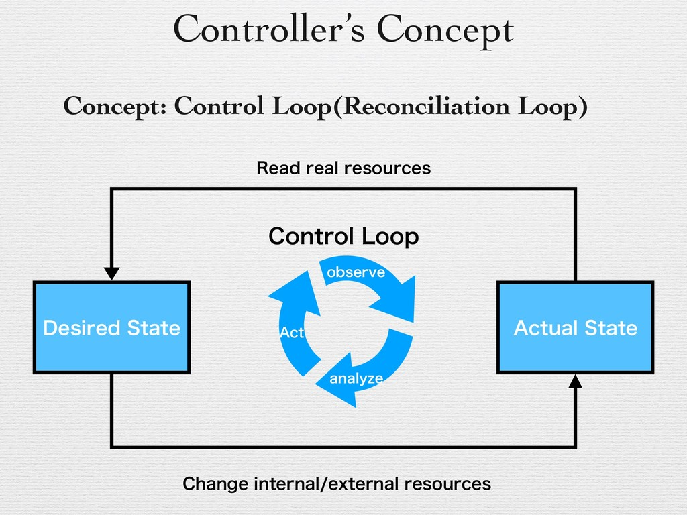
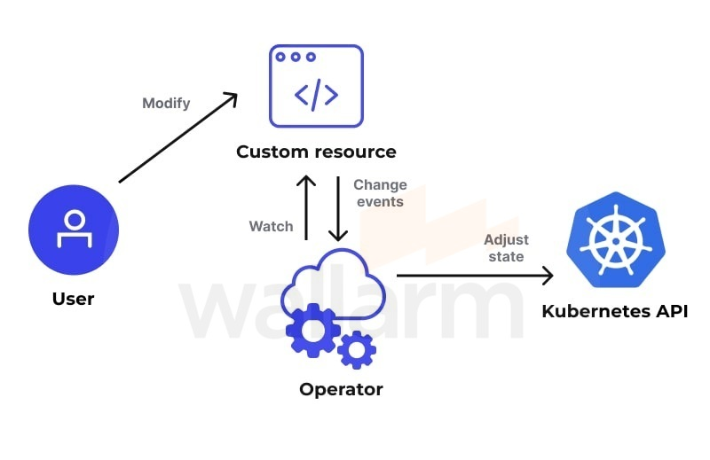

# Nội dung Seminar: Devworkspace Operator
## 1. Controller vs Operator
- Controller trong Kubernetes là một vòng lặp điều khiển, liên tục so sánh trạng thái mong muốn của các tài nguyên trọng cụm với trạng thái thực tế của nó rồi từ đó đưa ra điều chỉnh giúp chúng trở nên khớp với nhau.


- Quá trình hoạt động của Controller (flow):
  1. Kiểm tra trạng thái thực tế: Controller truy vấn API Server để lấy trạng thái hiện tại của tài nguyên mà nó quản lý.
  2. So sánh với mong muốn: Controller so sánh trạng thái thực tế với trạng thái mong muốn (ví dụ, số lượng Pods cần duy trì).
  3. Thực hiện hành động cần thiết: Nếu trạng thái thực tế không khớp với mong muốn, controller sẽ gửi yêu cầu đến API Server để điều chỉnh trạng thái. Điều này có thể bao gồm việc tạo thêm, xóa bớt, hoặc sửa đổi tài nguyên.
  4. Tiếp tục giám sát: Controller tiếp tục giám sát tài nguyên, luôn đảm bảo rằng trạng thái hệ thống luôn đạt được mục tiêu đề ra.
- Operator là một mở rộng của hành vi này. Với ví dụ đơn giản nhất, Operator thêm 1 endpoint vào trong Kubernetes API và gọi nó là Custom Resource (CR).


## 2. Custom Resource Definitions
- Custom Resource (CR) là một cơ chế mở rộng API trong Kubernetes. Custom Resource Definition định nghĩa cho các CRs.
- Operator là một custom controller quan sát các CR và điều chỉnh để chúng khớp với `Spec`.
- CRs nắm giữ các dữ liệu có cấu trúc và API server cung cấp cơ chế cho việc đọc và cài đặt các trường trong cấu trúc đó
- User định nghĩa các CRs chạy trên K8S bằng cách cung cấp các CRDs. Để hiểu đơn giản thì CRD là lược đồ, định nghĩa các trường và kiểu dữ liệu cho các trường của CR.
## 3. Devworkspace Operator
### 3.1 Introduction to DevWorkspace operator
DevWorkspace Operator là một operator cho Kubernetes quản lý vòng đời của devspace của developer. Nó chủ yếu được sử dụng trong các môi trường phát triển gốc trên nền tảng cloud để cung cấp các môi trường phát triển có thể định cấu hình và tái tạo. Operator cho phép người dùng tạo, quản lý và mở rộng devspace của developer dưới dạng tài nguyên Kubernetes.

Sau đây là một số khía cạnh chính của DevWorkspace Operator:
1. Devspace của developer dưới dạng tài nguyên Kubernetes:
  - Devspace của developer được biểu thị dưới dạng tài nguyên Kubernetes tùy chỉnh, nghĩa là chúng được xác định bằng Định nghĩa tài nguyên tùy chỉnh (CRD).
  - Các devspace này có thể bao gồm một IDE (ví dụ: Eclipse Theia hoặc VSCode), một bộ công cụ và các tệp dự án được chạy dưới dạng vùng chứa trong cụm Kubernetes.
2. Cấu hình thông qua DevWorkspace Custom Resource:
  - developer hoặc quản trị viên có thể xác định tài nguyên DevWorkspace, chỉ định cấu hình môi trường (như IDE, công cụ, hình ảnh thời gian chạy) cần thiết cho devspace.
  - Người vận hành sẽ đảm nhiệm việc triển khai và quản lý các tài nguyên này trong namespace Kubernetes.
3. Quản lý tự động:
- DevWorkspace Operator tự động hóa các tác vụ như tạo devspace, duy trì, mở rộng quy mô và xóa.
- Nó đảm bảo rằng mỗi devspace được tách biệt, duy trì (trong nhiều phiên) và sẵn sàng để truy cập từ xa.
4. Tích hợp với IDE gốc trên nền tảng cloud:
  - Nhà điều hành tích hợp với các IDE gốc trên nền tảng cloud như Eclipse Che, cho phép các developer có môi trường phát triển lưu trữ trên cloud dựa trên trình duyệt.
  - devspace được xây dựng trên các hình ảnh được chứa trong container, do đó chúng có tính di động và có thể được sao chép một cách nhất quán trên nhiều môi trường.
5. Các trường hợp sử dụng phổ biến:
  - Các nhóm có thể chia sẻ môi trường phát triển thống nhất.
  - Nhanh chóng tạo devspace cho các dự án khác nhau, loại bỏ vấn đề "nó hoạt động trên máy của tôi".
  - Tích hợp tốt vào quy trình CI/CD nơi thử nghiệm tự động, xây dựng hoặc thậm chí mã hóa có thể được thực hiện trong môi trường được quản lý và tạm thời.
6. Tùy chỉnh và khả năng mở rộng:
- DevWorkspace cho phép các developer tùy chỉnh định nghĩa devspace, thêm các công cụ cần thiết, cấu hình cài đặt IDE và bao gồm các dự án hoặc cơ sở mã có liên quan.
- Người vận hành đảm bảo tính nhất quán của devspace theo các cấu hình này, quản lý lưu trữ (để duy trì) và phân bổ tài nguyên.
7. Những lợi ích:
- Cô lập: Mỗi developer sẽ có một môi trường riêng biệt chạy trên Kubernetes, giúp giảm xung đột tài nguyên.
- Khả năng mở rộng: devspace có thể được mở rộng hoặc thu hẹp dễ dàng dựa trên tài nguyên trong cụm.
- Hợp tác: Dễ dàng chia sẻ, hợp tác và duy trì môi trường có thể tái tạo.


### 3.2 Custom Resource in Devworkspace operator
Trong Kubernetes, **DevWorkspace Operator** là một phần của hệ sinh thái DevWorkspace giúp tạo và quản lý môi trường phát triển (development environments) cho các lập trình viên. DevWorkspace cung cấp một cách tiếp cận để triển khai môi trường phát triển "self-contained" với các tài nguyên cần thiết, chẳng hạn như IDEs, công cụ phát triển, hoặc bất kỳ phần mềm nào được yêu cầu trong môi trường làm việc.

Các **Custom Resources (CRs)** trong DevWorkspace Operator là các đối tượng tùy chỉnh mà người dùng có thể sử dụng để định nghĩa các yêu cầu của môi trường phát triển. Dưới đây là một số Custom Resources phổ biến trong DevWorkspace Operator:

### 1. **DevWorkspace**
   - **Nhiệm vụ:** Định nghĩa một môi trường phát triển cụ thể, bao gồm các cấu hình cho IDE, công cụ phát triển, cũng như các dịch vụ cần thiết để lập trình viên làm việc.
   - **Thông tin:** Đối tượng này sẽ chứa cấu hình cho môi trường làm việc của lập trình viên như loại IDE, các công cụ cần thiết, cấu hình cho container, và các dịch vụ phụ trợ như database hoặc API.
   - **Cấu trúc:** 
     - `spec`: Định nghĩa các chi tiết như image của DevWorkspace, các dịch vụ cần thiết, và các công cụ hỗ trợ (ví dụ: VS Code, Eclipse Che).
     - `status`: Trạng thái hiện tại của môi trường phát triển, chẳng hạn như môi trường có sẵn hay đang tạo.

   **Ví dụ:**
   ```yaml
   apiVersion: devworkspace.k8s.io/v1alpha1
   kind: DevWorkspace
   metadata:
     name: example-devworkspace
   spec:
     template:
       spec:
         engines:
           - name: che-workspace
             container:
               image: che/che-server:v7.31.1
   ```
### 2. **DevWorkspaceOperatorConfig**
- DevWorkspace Operator cài đặt tài nguyên tùy chỉnh DevWorkspaceOperatorConfig (tên viết tắt: `dwoc`). Để cấu hình hành vi toàn cục của DevWorkspace Operator, cần tạo một DevWorkspaceOperatorConfig có tên devworkspace-operator-config trong cùng namespace triển khai operator:  
```yml
apiVersion: controller.devfile.io/v1alpha1
kind: DevWorkspaceOperatorConfig
metadata:
  name: devworkspace-operator-config
  namespace: $OPERATOR_INSTALL_NAMESPACE
config:
  # Configuration fields
```
### 2. **DevWorkspaceTemplate**
   - **Nhiệm vụ:** Đây là một bản mẫu (template) cho các DevWorkspace. Nó cho phép người dùng tạo ra một mẫu DevWorkspace có thể tái sử dụng, giúp việc cấu hình trở nên nhanh chóng và dễ dàng.
   - **Thông tin:** Các templates này có thể chứa cấu hình chung cho môi trường phát triển, như các dịch vụ, volume, các hình ảnh container, và các thiết lập mạng. DevWorkspace Operator có thể sử dụng các template này để khởi tạo một DevWorkspace mới.
   - **Cấu trúc:**
     - `spec`: Chứa các thông tin chung về môi trường, chẳng hạn như phần mềm, cấu hình dịch vụ, và các công cụ phát triển.

   **Ví dụ:**
   ```yaml
   apiVersion: devworkspace.k8s.io/v1alpha1
   kind: DevWorkspaceTemplate
   metadata:
     name: my-workspace-template
   spec:
     template:
       spec:
         engines:
           - name: vscode
             container:
               image: codercom/code-server:latest
   ```

### 4. **DevWorkspaceRouting**
DevWorkspaceRouting được thiết kế để quản lý và định tuyến các yêu cầu đến các DevWorkspaces. Cụ thể:
  - Định tuyến Yêu cầu: DevWorkspaceRouting cho phép định tuyến các yêu cầu (request) từ bên ngoài vào các DevWorkspace tương ứng, đảm bảo rằng mỗi yêu cầu được chuyển đến đúng dịch vụ hoặc ứng dụng.
  - Quản lý Tên miền và URL: Nó cho phép cấu hình tên miền và URL cho từng DevWorkspace, giúp người dùng dễ dàng truy cập vào môi trường phát triển của mình thông qua các địa chỉ dễ nhớ.
  - Hỗ trợ Nhiều Môi Trường: DevWorkspaceRouting có thể được sử dụng để định tuyến đến nhiều môi trường phát triển khác nhau trong cùng một cluster Kubernetes, giúp người dùng có thể thử nghiệm hoặc phát triển nhiều dự án cùng lúc.
  - Tính Linh Hoạt và Tùy Chỉnh: Người dùng có thể tùy chỉnh các quy tắc định tuyến để phù hợp với nhu cầu cụ thể của dự án hoặc tổ chức, bao gồm việc định tuyến theo địa chỉ IP, tên người dùng, hoặc các tham số khác.
  - Tích hợp với Các Dịch Vụ Khác: DevWorkspaceRouting có thể tích hợp với các dịch vụ khác trong Kubernetes, như ingress controllers, để cải thiện khả năng quản lý và bảo mật trong việc truy cập các DevWorkspaces.

Tóm lại, DevWorkspaceRouting giúp đơn giản hóa việc truy cập và quản lý các DevWorkspaces, cải thiện trải nghiệm phát triển và hỗ trợ việc phát triển đồng thời nhiều dự án trong môi trường Kubernetes.
### Tóm tắt nhiệm vụ của các CRs:
1. **DevWorkspace**: Định nghĩa môi trường phát triển cho người dùng.
2. **DevWorkspaceTemplate**: Cung cấp mẫu DevWorkspace có thể tái sử dụng.

Các CRs này giúp DevWorkspace Operator tự động hóa quá trình triển khai và quản lý các môi trường phát triển trong Kubernetes, tối ưu hóa quy trình làm việc của lập trình viên và các nhóm phát triển phần mềm.